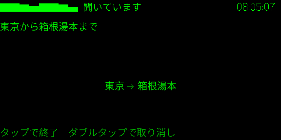
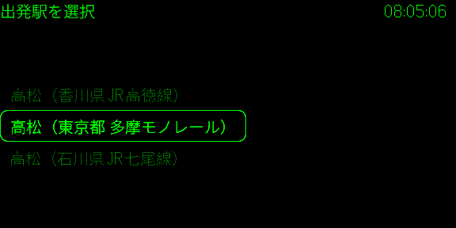
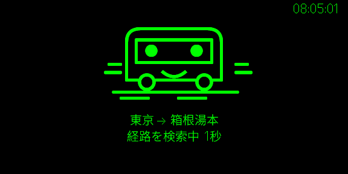
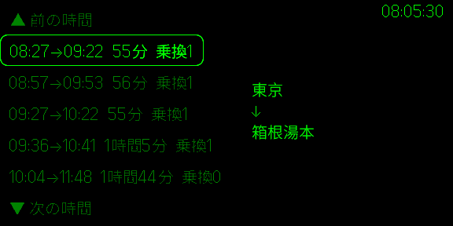
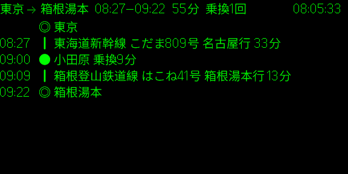
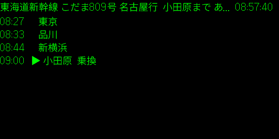
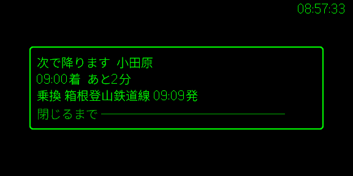

# Train JP

Train JP は、Even Realities G2 で使う日本の電車の乗換案内アプリです。出発駅と到着駅を音声で伝えると、乗る電車と乗り換えをグラスに表示します。

## 画面

### 検索

出発駅と到着駅を音声で入力し、必要なら駅を選ぶ。

<table>
  <tr>
    <td align="center"><strong>入力待ち</strong> </td>
    <td align="center"><strong>音声検索</strong> </td>
  </tr>
  <tr>
    <td align="center"><strong>駅の選択</strong> </td>
    <td align="center"><strong>検索中</strong> </td>
  </tr>
</table>

### 経路を選ぶ

候補から経路を選び、全体の流れを確認する。

<table>
  <tr>
    <td align="center"><strong>候補一覧</strong> </td>
    <td align="center"><strong>全体図</strong> </td>
  </tr>
</table>

### 乗降時間

乗車中は、残り時間、次の乗り換え、途中駅を確認できる。降りる駅が近づくと知らせる。

<table>
  <tr>
    <td align="center"><strong>下端2行</strong> </td>
    <td align="center"><strong>途中駅</strong> </td>
  </tr>
  <tr>
    <td align="center"><strong>降りる駅の知らせ</strong> </td>
    <td></td>
  </tr>
</table>

## データの出典

- 経路は [Transitous](https://transitous.org/sources/)（© [OpenStreetMap](https://www.openstreetmap.org/copyright) contributors）
- 路線名は [HeartRails Express](http://express.heartrails.com/) から取得
